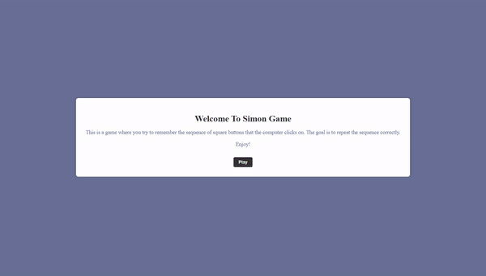

# Simon Game

Simon is a popular electronic memory game that was first introduced in the 1970s. The game consists of four colored buttons that light up in a specific sequence, and the player must repeat the sequence correctly to advance to the next level. The game gets progressively more difficult as the levels increase, with longer and more complex sequences to memorize. Simon has since been adapted into various electronic and online versions, and it is a popular game for improving memory and concentration skills.

## Usage video

